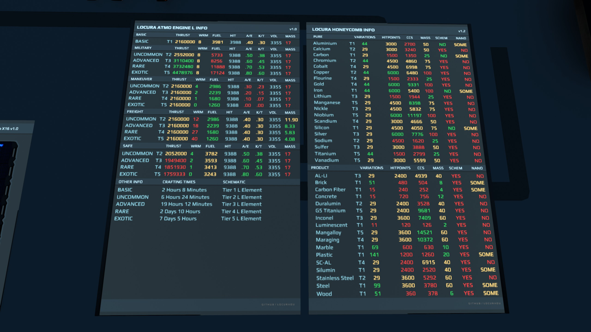

:heavy_exclamation_mark: | Purchase of this code in game is for your own use. Please respect our work and do not share, sell, or give away our work. Any code found in game that is being used by non authorized players will be reported to NQ. We have other amazing scripts that you can freely use and modify.
:---: | :---

:heavy_exclamation_mark: | Use Honeycomb Info v1.1. v1.2 is for game v1.3 release which is not out yet.
:---: | :---

# Information
 A collection of information screens. Made for diplays, or help for builders. 

---

---
| Screen  | Current Version |
| ------------- | ------------- |
|HoneyComb Info||
|Atmoshperic Engine L Info||
|Atmoshperic Engine Info||

# Preview

# Installation / Documentation / Wiki

# Screen And Sign Compatibility

# Ways To Help
- Send an in game tip to "Credence"
- Contribute new code, or updating whats already here
- Donate for Dr Pepper funds at Venmo @terranbytes
- Join or start a discussion on the discussions tab

# Contacts
- Credence (Dual Universe)
- Credence#1983 (Discord)
- CredenceHamby (GitHub)

# Other
> **Note**
> - Made possible with help from (https://github.com/Jericho1060)
> - Made possible with help from (https://github.com/BartasRS)

> **Warning**
> This may or may not work with some screens or signs. Please check list above for compatibility.

> **Warning**
> Too many screen in an area will hurt game performance. The game will also start throttling back screen quality upon reaching a certain number of screens. Using Animations in screens will make this much worse. Only use a few animated screens in an area for best performance.
